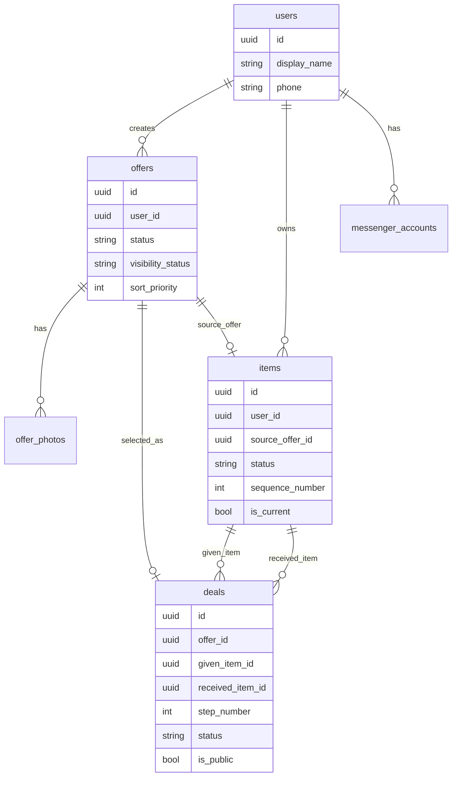

# DB Schema

Краткое описание таблиц и связей MVP.

## Chain ERD

## users

Пользователь сервиса.

Ключевые поля:

- `id`
- `display_name`
- `phone`
- `phone1`
- `phone2`
- `email`
- `created_at`
- `updated_at`

Связи:

- `users 1:N offers`
- `users 1:N items`
- `users 1:N messenger_accounts`

## messenger_accounts

Привязка пользователя к внешнему мессенджеру.

Ключевые поля:

- `id`
- `user_id`
- `messenger_type`
- `external_user_id`
- `username`
- `first_name`
- `last_name`
- `created_at`

Ограничение:

- уникальная пара `messenger_type + external_user_id`.

## offers

Входящие заявки пользователей. Заявка сама по себе не является предметом публичной цепочки: админ может оценить её, скрыть, отклонить или выбрать следующим предметом цепочки.

Ключевые поля:

- `id`
- `user_id`
- `title`
- `description`
- `offer_type`
- `city`
- `declared_value`
- `moderated_value`
- `public_value`
- `valuation_source`
- `moderation_comment`
- `exchange_preference`
- `status`
- `visibility_status`
- `sort_priority`
- `is_public`
- `public_comment`
- `participant_public_name`
- `participant_visible`
- consent/contract fields
- `created_at`
- `updated_at`

MVP-статусы:

- `new`
- `reviewed`
- `selected`
- `hidden`
- `rejected`

Legacy-статусы сохранены для обратной совместимости:

- `moderation`
- `approved`
- `published`
- `archived`

Видимость в админской очереди:

- `normal`
- `low_priority`
- `hidden`

Поле `sort_priority` помогает админам поднимать/опускать заявки в рабочем списке.

Связи:

- `offers N:1 users`
- `offers 1:N offer_photos`
- `offers 0:1 deals` в основной цепочке: выбранная заявка становится источником `received_item`.

## offer_photos

Фотографии оффера.

Ключевые поля:

- `id`
- `offer_id`
- `photo_url`
- `thumbnail_url`
- `width`
- `height`
- `thumbnail_width`
- `thumbnail_height`
- `size_bytes`
- `thumbnail_size_bytes`
- `created_at`

Связи:

- `offer_photos N:1 offers`

## items

Реальные предметы цепочки обменов. Стартовый предмет создаёт админ, следующий предмет создаётся из выбранной заявки через `POST /api/admin/offers/{offer_id}/select-next`.

Ключевые поля:

- `id`
- `user_id`
- `title`
- `description`
- `item_type`
- `internal_value`
- `valuation_source`
- `owner_type`
- `owner_name`
- `status`
- `source_offer_id`
- `sequence_number`
- `is_current`
- `is_public`
- `public_story`
- `photo_url`
- `thumbnail_url` хранится в `item_photos`; если его нет, frontend использует `photo_url`.
- `created_at`
- `updated_at`

Статусы основной цепочки:

- `current`
- `past`
- `final`
- `planned`

Legacy-статусы:

- `active`
- `archived`

Связи:

- `items N:1 users`
- `items N:1 offers` через `source_offer_id`, если item создан из заявки.
- `items 1:N deals` через `deals.given_item_id`
- `items 1:N deals` через `deals.received_item_id`

## deals

Переходы между предметами цепочки. В основной модели сделка показывает, какой `item` проект отдал и какой `item` получил.

Ключевые поля:

- `id`
- `offer_id`
- `step_number`
- `given_item_id`
- `received_item_id`
- `status`
- `participant_user_id`
- `participant_public_name`
- `participant_visible`
- `public_story`
- `video_url`
- `is_public`
- `deal_date`
- `created_at`
- `updated_at`

Статусы основной цепочки:

- `planned`
- `completed`
- `cancelled`

Legacy-статусы откликов:

- `new`
- `accepted`
- `rejected`

Связи:

- `deals N:1 offers`
- `deals N:1 items` через `given_item_id`
- `deals N:1 items` через `received_item_id`
- `participant_user_id` может ссылаться на `users`.

Для публичной истории используются только:

- `is_public=true`
- `status=completed`

Сортировка публичной цепочки идёт по `step_number ASC`. Во frontend этот номер используется как технический порядок, а не как обязательный заголовок “Шаг №”.

## alembic_version

Служебная таблица Alembic.

Ключевые поля:

- `version_num`

Обычно не редактируется вручную.

## auth_accounts

Логин/пароль для сайта.

Ключевые поля:

- `id`
- `user_id`
- `login`
- `password_hash`
- `auth_type`
- `is_active`
- `created_at`
- `updated_at`

Пароль хранится только как hash. Текущий MVP использует PBKDF2 SHA-256.

## roles

Справочник ролей.

Начальные роли:

- `user`
- `editor`
- `moderator`
- `admin`
- `super_admin`

## user_roles

Назначение ролей пользователям.

Ключевые поля:

- `user_id`
- `role_id`
- `assigned_by_user_id`
- `created_at`

Ограничение:

- уникальная пара `user_id + role_id`.

## Auth Notes

В `users` добавлены:

- `phone_verified`
- `is_active`

Объединение Telegram/MAX/site пользователей должно выполняться только через подтверждённый телефон:

- `users.phone` совпадает;
- `users.phone_verified=true`;
- неподтверждённый телефон нельзя использовать для автоматического объединения аккаунтов.
